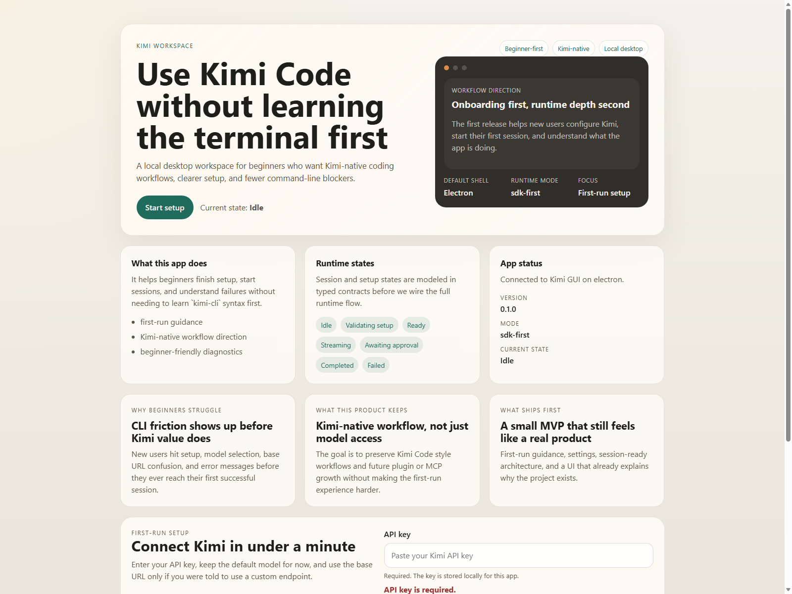

# Kimi GUI

Beginner-first local GUI for the Kimi coding runtime.

This project aims to make Kimi easier to use for people who are not comfortable with command-line tools. Instead of memorizing commands, users should be able to configure access, start coding sessions, run common actions, and understand failures through a visual workspace.



## Why This Exists

Kimi's coding runtime is powerful, but its CLI-first shape raises the barrier for new users. This project tries to preserve Kimi-native workflows while replacing first-contact terminal friction with a guided desktop experience.

## Status

Working MVP.

Current capabilities:
- Guided first-run setup for Kimi and compatible providers
- Real Kimi SDK-backed sessions with streamed text output
- Live runtime activity logs and in-app approval handling
- Five beginner-friendly quick actions for common coding tasks
- Expandable diagnostics report for issue filing and troubleshooting
- Public repository structure ready for incremental open development

## Quick Start

1. Install dependencies:
   - `npm install`
2. Start the web renderer:
   - `npm run dev`
3. Start the desktop app:
   - `npm run electron:dev`
4. Verify the project:
   - `npm run test`
   - `npm run typecheck`
   - `npm run lint`
   - `npm run build`
   - `npm run audit:publish`

Note:
- If Electron binary download fails on your network, rerun `npm install` and then try `npm run electron:dev` again.

## What You Can Try

After launching the desktop app, the current MVP supports this flow:

1. Save provider settings in the first-run setup panel.
2. Create a new session.
3. Use one of the built-in quick actions or write your own prompt.
4. Watch Kimi stream its response into the conversation.
5. Review runtime activity logs while the request is running.
6. Approve or reject paused runtime actions from the GUI when approval is required.
7. Open and copy the diagnostics report if you need to file an issue or inspect the current runtime state.

## Troubleshooting

- `Kimi CLI was not found`
  Install Kimi CLI locally before expecting real Kimi-native execution.
- `Installed, login needed`
  Complete local Kimi login first, then reopen or refresh the app.
- Prompt runs but compatible providers return placeholder text
  This is expected in the current MVP. Real execution is only wired for the `kimi` provider.
- Approval panel appears
  The runtime is waiting for your decision. Use `Approve` or `Reject` in the session view to continue.
- Need help filing a bug
  Open the diagnostics panel in a session and copy the generated report into your issue.

## Commands

| Command | Description |
|---------|-------------|
| `npm run dev` | Start the Vite renderer |
| `npm run electron:dev` | Start the Electron app against the local renderer |
| `npm run test` | Run unit tests |
| `npm run typecheck` | Run TypeScript checks |
| `npm run lint` | Run ESLint |
| `npm run build` | Build renderer and Electron main-side code |
| `npm run audit:publish` | Scan the workspace for local artifacts and likely secrets before publishing |

## Project Goals

- Make first-run setup understandable without terminal knowledge
- Expose common Kimi coding workflows through visible actions
- Preserve advanced diagnostics without overwhelming beginners
- Stay resilient to upstream `kimi-cli` / `Kimi Code` naming and interface changes

## Non-Goals For MVP

- Full parity with every upstream CLI feature
- Plugin marketplace support
- Multi-device sync
- Team collaboration
- Deep IDE integration from day one

## Repository Structure

```text
.github/      Issue and PR templates
docs/
  adr/        Architecture decisions
  specs/      Product and technical specifications
  roadmap.md  Near-term milestones
src/          Frontend app
src-main/     Electron main-side runtime layer
tasks/
  plan.md     Implementation plan
  todo.md     Ordered task list
tests/        Unit and integration tests
```

## Architecture

- `src/` contains the renderer UI
- `src-main/` contains the Electron main-side runtime adapter and local storage
- `src/shared/` contains app-facing contracts shared between the renderer and main side
- `docs/adr/` explains major architectural choices and tradeoffs

## Key Documents

- Spec: [docs/specs/kimi-gui-mvp.md](docs/specs/kimi-gui-mvp.md)
- ADR 0001: [docs/adr/0001-product-direction.md](docs/adr/0001-product-direction.md)
- ADR 0002: [docs/adr/0002-runtime-integration.md](docs/adr/0002-runtime-integration.md)
- ADR 0003: [docs/adr/0003-desktop-shell.md](docs/adr/0003-desktop-shell.md)
- Roadmap: [docs/roadmap.md](docs/roadmap.md)
- Release checklist: [docs/release-checklist.md](docs/release-checklist.md)
- Plan: [tasks/plan.md](tasks/plan.md)
- Tasks: [tasks/todo.md](tasks/todo.md)

## Current MVP Focus

- first-run onboarding
- local settings flow
- provider profiles for Kimi and compatible APIs
- real Kimi session flow with streaming and approvals
- guided quick actions for common beginner tasks
- diagnostics reports and future-ready Kimi-native extensions

## Contributing

See [CONTRIBUTING.md](CONTRIBUTING.md).

## License

[MIT](LICENSE)

## Sources

- [Claude Code](https://github.com/anthropics/claude-code)
- [Kimi Code](https://github.com/MoonshotAI/kimi-code)
- [Kimi Agent SDK](https://github.com/MoonshotAI/kimi-agent-sdk)
