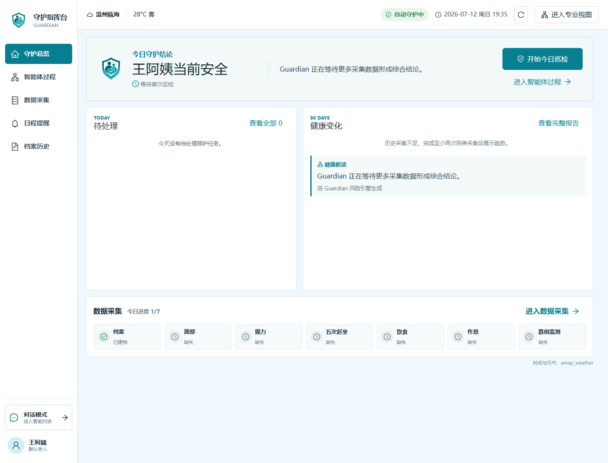

# Kimi GUI

一次面向中文新手的 Kimi Code 桌面工作流实验。

[](https://github.com/WilliamClifton-dev/kimi-gui/actions/workflows/ci.yml)
[](LICENSE)

> **项目状态：实验完成，暂停新增功能。**
>
> 项目验证了 Electron 中接入 Kimi Agent SDK、流式输出、GUI 审批、环境诊断和 Windows 发布流程。调研后发现，官方 Kimi 桌面端与 `kimi web` 已覆盖大部分工作区需求，CC Switch 也已完整覆盖多供应商配置管理。继续扩展会变成重复建设，因此保留成果，不再追求完整产品化。



## 做过什么

`v0.2.1` 已实现并发布：

- React 19、TypeScript、Vite 与 Electron 桌面架构
- `@moonshot-ai/kimi-agent-sdk` 真实 Kimi 会话
- 增量文本流式输出
- 运行活动日志与 GUI 审批
- 中文配置、错误说明和五个新手任务模板
- 脱敏诊断报告与发布前密钥扫描
- Windows 安装版、便携版和 GitHub Actions 发布流程
- Node ESM 与 Electron `file://` 打包回归测试

当前源码还包含一个未发布的 **Kimi Code 新手助手原型**：

- 检测 Kimi Code 安装、版本、登录和模型状态
- 使用系统目录选择器选择项目
- 通过受控 IPC 启动官方 `kimi web`
- 不复制官方聊天和会话工作区

## 为什么暂停

最初假设：中文新手需要一个完整的 Kimi Code GUI。

验证结果：

- 官方 `kimi web` 已提供会话、审批、文件引用、Plan、工具输出和模型管理
- Kimi 官方桌面端已经是完整、成熟的通用 AI 产品
- CC Switch 已覆盖 Claude Code、Codex、Gemini CLI 等工具的供应商和配置管理
- 独立项目剩余差异主要是安装引导与环境排障，价值不足以支持持续追赶上游

停止条件已经触发：如果差异只剩视觉样式或重复官方能力，就停止开发。详见 [产品转向 ADR](docs/adr/0005-pivot-to-beginner-companion.md) 和 [产品定义](docs/ideas/kimi-code-beginner-companion.md)。

## 仍有价值的部分

这个仓库可作为以下实现参考：

- Electron renderer、preload 与 main 进程的窄类型 IPC
- 本地 Agent SDK 的流式事件映射
- 人机审批状态建模
- 不向 renderer 暴露 API Key 的环境检测
- 不使用 shell 拼接参数的本地进程启动
- Electron 打包、CI、Release 和密钥泄露检查
- 用 ADR 记录产品假设、转向与停止决策

## 下载

[GitHub Releases](https://github.com/WilliamClifton-dev/kimi-gui/releases) 中的 `v0.2.1` 是最后一个已发布安装包：

- `Kimi-GUI-Setup-版本-x64.exe`：Windows 安装版
- `Kimi-GUI-Portable-版本-x64.exe`：Windows 便携版

注意：`v0.2.1` 是早期完整工作台 MVP，不是当前源码中的新手助手原型。安装包没有商业代码签名，Windows 可能显示 SmartScreen 提示。

## 从源码运行

需要 Node.js 20 或更高版本。

```bash
git clone https://github.com/WilliamClifton-dev/kimi-gui.git
cd kimi-gui
npm install
npm run electron:dev
```

只预览 renderer：

```bash
npm run dev
```

## 质量检查

```bash
npm run test
npm run typecheck
npm run lint
npm run build
npm run audit:publish
```

## 项目结构

```text
src/          React renderer
src-main/     Electron 主进程、存储与运行时适配
docs/adr/     架构和产品决策
docs/ideas/   产品验证记录
docs/specs/   原始 MVP 规格
tasks/        实现计划与任务
tests/unit/   单元与打包回归测试
```

## 关键文档

- [新手助手产品定义](docs/ideas/kimi-code-beginner-companion.md)
- [停止完整工作区方向的 ADR](docs/adr/0005-pivot-to-beginner-companion.md)
- [原始产品方向](docs/adr/0001-product-direction.md)
- [运行时集成](docs/adr/0002-runtime-integration.md)
- [桌面壳层](docs/adr/0003-desktop-shell.md)
- [提供方配置](docs/adr/0004-provider-profiles.md)

## 参考

- [Kimi Code](https://github.com/MoonshotAI/kimi-cli)
- [Kimi Agent SDK](https://github.com/MoonshotAI/kimi-agent-sdk)
- [Codex++](https://github.com/BigPizzaV3/CodexPlusPlus)
- [CC Switch](https://github.com/farion1231/cc-switch)

## 许可证

[MIT](LICENSE)
